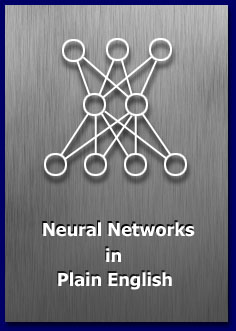
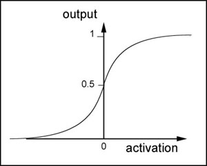

# neural-network-tutorial




## Introduction
 
I have been interested in artificial intelligence and artificial life for years and I read most of the popular books printed on the subject. I developed a grasp of most of the topics yet neural networks always seemed to elude me. Sure, I could explain their architecture but as to how they actually worked and how they were implemented… well that was a complete mystery to me, as much magic as science. I bought several books on the subject but every single one attacked the subject from a very mathematical and academic viewpoint and very few even gave any practical uses or examples. So for a long long time I scratched my head and hoped that one day I would be able to understand enough to experiment with them myself.
 
That day arrived some time later when - sat in a tent in the highlands of Scotland reading a book - I had a sudden blast of insight. It was one of those fantastic “eureka” moments and although Scotland is a beautiful place I couldn’t wait to get to a computer so I could try out what I’d just learnt. To my surprise the first neural net I programmed worked perfectly and I haven’t looked back since. I still have a great deal to learn, neural nets are a huge subject, but I hope I can share enough knowledge and enthusiasm to get you started on your own little projects. In many ways the fields of AI and A-Life are very exciting to work in. I think of these subjects as the explorers of old must have looked at all those vast empty spaces on the maps. There is so much to learn and discover.

I’ll start off by describing what a neural net actually is and what it’s architecture is, then I’ll do a little theory on how we get it to perform for us but I’ll try to use as little maths as possible. (Having some understanding of mathematics is impossible to avoid however and the deeper you get into this topic the more mathematics you are going to have to learn). Finally, we’ll get to the fun bit. I’ll come up with a little project I will program and take you through one step at a time. It will be in this last phase of the tutorial where I hope you get the same “eureka” feeling for neural nets as I did back in rainy old Scotland. Until then just sit back, absorb and be patient.


## So, what exactly is a Neural Network?

A neural network is mans crude way of trying to simulate the brain electronically. So to understand how a neural net works we first must have a look at how the old grey matter does its business…

Our brains are made up of about 100 billion tiny units called neurons. Each neuron is connected to thousands of other neurons and communicates with them via electrochemical signals. Signals coming into the neuron are received via junctions called synapses, these in turn are located at the end of branches of the neuron cell called dendrites. The neuron continuously receives signals from these inputs and then performs a little bit of magic. What the neuron does (this is over simplified I might add) is sum up the inputs to itself in some way and then, if the end result is greater than some threshold value, the neuron fires. It generates a voltage and outputs a signal along something called an axon. Don't worry too much about remembering all these new words as we won’t be using many of them from this moment onwards, just have a good look at the illustration and try to picture what is happening within this simple little cell.

<div style="width:40%; margin:auto; margin-bottom:10px; margin-top:20px;">

</div>

Neural networks are made up of many artificial neurons. An artificial neuron is simply an electronically modelled biological neuron. How many neurons are used depends on the task at hand. It could be as few as three or as many as several thousand. One optimistic researcher has even hard wired 2 million neurons together in the hope he can come up with something as intelligent as a cat although most people in the AI community doubt he will be successful (Update: he wasn't!). There are many different ways of connecting  artificial neurons together to create a neural network but I shall be concentrating on the most common which is called a feedforward network. So, I guess you are asking yourself, what does an artificial neuron look like? Well here you go:

<div style="width:40%; margin:auto; margin-bottom:10px; margin-top:20px;">

</div>

Each input into the neuron has its own weight associated with it illustrated by the red circle. A weight is simply a floating point number and it's these we adjust when we eventually come to train the network. The weights in most neural nets can be both negative and positive, therefore providing excitory or inhibitory influences to each input. As each input enters the nucleus (blue circle) it's multiplied by its weight. The nucleus then sums all these new input values which gives us the activation (again a floating point number which can be negative or positive). If the activation is greater than a threshold value - lets use the number 1 as an example - the neuron outputs a signal. If the activation is less than 1 the neuron outputs zero. This is typically called a step function (take a peek at the following diagram and have a guess why).

<div style="width:40%; margin:auto; margin-bottom:10px; margin-top:20px;">

</div>


## Now for some maths

I now have to introduce you to some equations. I’m going to try to keep the maths down to an absolute minimum but it will be useful for you to learn some notation.  I’ll feed you the maths little by little and introduce new concepts when we get to the relevant sections. This way I hope your mind can absorb all the ideas a little more comfortably and you'll be able to see how the maths are put to work at each stage in the development of a neural net.

A neuron can have any number of inputs from one to n, where n is the total number of inputs. The inputs may be represented  therefore as x1, x2, x3… xn. And the corresponding weights for the inputs as w1, w2, w3… wn. Now, the summation of the weights multiplied by the inputs we talked about above can be written as x1w1 + x2w2 + x3w3 …. + xnwn,  which I hope you remember is the activation value. So…

a = x1w1+x2w2+x3w3... +xnwn

Fortunately there is a quick way of writing this down which uses the Greek capital letter sigma S, which is the symbol used by mathematicians to represent summation.

<div style="width:40%; margin:auto; margin-bottom:10px; margin-top:20px;">

</div>

Maybe just to clarify what this means I should write it out in code. Assuming an array of inputs and weights are already initialized as x[n] and w[n] then:
```code
double activation = 0;

for (int i=0; i<n; i++)
{
   activation += x[i] * w[i];
}
```
Got it? Now remember that if the activation > threshold we output a 1 and if activation < threshold we output a 0.

Let me illustrate everything I've shown you so far with a diagram.

<div style="width:40%; margin:auto; margin-bottom:10px; margin-top:20px;">

</div>

Please ensure that you understand exactly how to calculate the activation value before you move on.


## I understand all that but how do you actually use an artificial neuron?

Well, we have to link several of these neurons up in some way. One way of doing this is by organising the neurons into a design called a feedforward network. It gets its name from the way the neurons in each layer feed their output forward to the next layer until we get the final output from the neural network. This is what a very simple feedforward network looks like:

<div style="width:40%; margin:auto; margin-bottom:10px; margin-top:20px;">

</div>

Each input is sent to every neuron in the hidden layer and then each hidden layer’s neuron’s output is connected to every neuron in the next layer. There can be any number of hidden layers within a feedforward network but one is usually enough to suffice for most problems you will tackle. Also the number of neurons I've chosen for the above diagram was completely arbitrary. There can be any number of neurons in each layer, it all depends on the problem. By now you may be feeling a little dazed by all this information so I think the best thing I can do at this point would be to give you a real world example of how a neural net can be used in the hope that I can get your very own brain’s neurons firing!

You probably know already that a popular use for neural nets is character recognition. So let's design a neural network that will detect the number '4'. Given a panel made up of a grid of lights which can be either on or off, we want our neural net to let us know whenever it thinks it sees the character '4'. The panel is eight cells square and looks like this:

<div style="width:40%; margin:auto; margin-bottom:10px; margin-top:20px;">

</div>

We would like to design a neural net that will accept the state of the panel as an input and will output either a 1 or zero. A 1 to indicate that it thinks the character ‘4’ is being displayed and 0 if it thinks it's not being displayed. Therefore the neural net will have 64 inputs, each one representing a particular cell in the panel and a hidden layer consisting of a number of neurons (more on this later) all feeding their output into just one neuron in the output layer. I hope you can picture this in your head because the thought of drawing all those little circles and lines for you is not a happy one <smile>.

Once the neural network has been created it needs to be trained. One way of doing this is initialize the neural net with random weights and then feed it a series of inputs which represent, in this example, the different panel configurations. For each configuration we check to see what its output is and adjust the weights accordingly so that whenever it sees something looking like a number 4 it outputs a 1 and for everything else it outputs a zero. This type of training is called supervised learning and the data we feed it is called a training set. There are many different ways of adjusting the weights, the most common for this type of problem is called backpropagation. I will not be going into backprop in this tutorial as I will be showing you a completely different way of training neural nets which requires no supervision whatsoever (and hardly any maths - woohoo!)

If you think about it, you could increase the outputs of this neural net to 10.  This way the network can be trained to recognize all the digits 0 through to 9. Increase them further and it could be trained to recognize the alphabet too!

Are you starting to get a feel for neural nets now? I hope so. But even if you’re not all that will hopefully change in a moment when you start to see some code.


## So, what’s our project going to be fup?

We are going to evolve virtual minesweepers to find and collect land-mines scattered about a very simple 2D world. ( In the original version of this tutorial the program evolved ants that collected food but I fancied a change. ;0) )

This is a screenshot of the application:

<div style="width:40%; margin:auto; margin-bottom:10px; margin-top:20px;">

</div>

As you can see it's a very simple display. The minesweepers are the things that look like tanks and the land-mines are represented by the green dots. Whenever a minesweeper finds a mine it is removed and another mine is randomly positioned somewhere else in the world, thereby ensuring there is always a constant amount of land-mines on display. The minesweepers drawn in red are the best performing minesweepers the program has evolved so far.

How is a neural net going to control the movement of a minesweeper? Well, just like the control of a real tank, the minesweepers are controlled by adjusting the speed of a left track and a right track. By applying various forces to the left and right side of a minesweeper we can give it a full range of movement. So the network requires two outputs, one to designate the speed of the left track, and the other to designate the speed of the right track.

The more thoughtful of you may be wondering how on earth we can apply varying forces when all we've discussed so far are binary networks outputting 1’s and 0’s. The secret to this is that instead of using a simple step (threshold) activation function we use one which softens the output of each neuron to produce a symmetrical curve. There are several functions which will do this and we are going to use one called the sigmoid function. (sigmoid, or sigmoidal is just a posh way of saying something is S shaped)

<div style="width:40%; margin:auto; margin-bottom:10px; margin-top:20px;">

</div>

This equation may look intimidating to some of you but it’s very simple really. The e is a mathematical constant which approximates to 2.7183, the a is the activation into the neuron and p is a number which controls the shape of the curve. p is usually set to 1.0.

This function is terrific and comes in handy for all sorts of different uses because  it produces an output like this:

<div style="width:40%; margin:auto; margin-bottom:10px; margin-top:20px;">

</div>

The lower the value of p the more the curve begins to look like a step function. Also please note this curve is always centred around 0.5. Negative activation values produce a result less than 0.5, positive activation values produce a result greater than 0.5.

Therefore, to obtain a continuously graded output between 0 and 1 from our neurons we just have to put the sum of all the inputs x weights through the sigmoid function and Bob’s your uncle! So that’s our outputs dealt with, what about the inputs?

I have chosen to have four inputs. Two of them represent a vector pointing to the closest land-mine and the other two represent the direction the minesweeper is pointing. I call this vector, the minesweepers look-at vector.  These four inputs give the minesweeper's brain - its neural network - everything it needs to know to figure out how to orient itself towards the mines.

Now we have defined our inputs and our outputs what about the hidden layer/s? How do we decide how many layers we should have and how many neurons we should have in each layer? Well, this is a matter of guesswork and something you will develop a ‘feel’ for. There is no known rule of thumb although plenty of researchers have tried to come up with one. By default the simulation uses one hidden layer that contains six neurons although please spend some time experimenting with different numbers to see what effect they may have. I’d like to emphasise here that the more you play around with all the parameters the better the ‘feel’ you are going to develop and the better your neural networks will be.

Time to look at some code now. Here's a quick breakdown of the important classes.

CNeuralNet is the neural net class (surprise surprise).

CGenAlg is the genetic algorithm class.

CMineSweeper is a data and controller class for each minesweeper.

CController is the controller class which ties all the other classes together.

CParams is a class which loads in all the parameters for the application. They can be found in the file 'params.ini'. I strongly suggest you play around with the settings in this file when you start to play around with the code.

## The CNeuralNet class

Let’s get started on the neural network class, CNeuralNet. We want this class to be flexible so it can be used in other projects and as simple to use as possible. We need to be able to set up a neural network with any amount of inputs and outputs and any amount of neurons in any amount of hidden layers.  So how do we do this? Well, first we need to define structures for a neuron and a neuron layer. Let’s have a look at the definition of these structures… first the neuron:
```code
struct SNeuron
{

   //the number of inputs into the neuron

   int m_NumInputs;


   //the weights for each input

   vector<double> m_vecWeight;


   //ctor

   SNeuron(int NumInputs);

};
```

This is very simple, we just need to keep a record of how many inputs there are into each neuron and a std::vector of doubles in which we will store all the weights. Remember, there's a weight for every input into the neuron. When a SNeuron object is created, all the weights are initialized with random values.

<div style="width:40%; margin:auto; margin-bottom:10px; margin-top:20px;">

</div>

This is the constructor for SNeuron:
```code
SNeuron::SNeuron(int NumInputs): m_NumInputs(NumInputs+1)
{

  //we need an additional weight for the bias hence the +1

  for (int i=0; i<NumInputs+1; ++i)

  {

    //set up the weights with an initial random value

    m_vecWeight.push_back(RandomClamped());

  }

}
```

This takes the number of inputs going into the neuron as an argument and creates a vector of random weights. One weight for each input.

What’s that I hear you say? There’s an extra weight there! Well I’m glad you spotted that because that extra weight is quite important but to explain why it’s there I’m going to have to do some more maths. Remember that our activation was the sum of all the inputs x weights and that the output of the neuron was dependent upon whether or not this activation exceeded a threshold value (t)? And that this could be represented in equation form by

x1w1 + x2w2 + x3w3… + xnwn >= t

Because the network weights are going to be evolved it would be great if the threshold value could be evolved too. To make this easy I'm going to use a little trick to make it appear as a weight. All you have to do is subtract t from either side of the equation and we get:

x1w1 + x2w2 + x3w3… + xnwn – t >= 0

or we can write this another way:

x1w1 + x2w2 + x3w3… + xnwn + (-1)t >= 0

So you can see (hopefully) that we can treat the threshold as a weight that is always multiplied by an input of -1. This is usually referred to as the bias.

And that's why each neuron is initialized with one additional weight. Because now when the network is evolved we don’t have to worry about the threshold value as it's built in with the weights and will take care of itself. Good eh?

Lets get on with the rest of the neural net code… The next structure defines a layer of neurons.
```code
struct SNeuronLayer
{

  //the number of neurons in this layer

  int m_NumNeurons;


  //the layer of neurons

  vector<SNeuron> m_vecNeurons;


  SNeuronLayer(int NumNeurons, int NumInputsPerNeuron);

};
```

As you can see this just groups together a bunch of neurons into a layer. The CNeuralNet class is much more exciting, so let's move on and take a look at its definition:
```code
class CNeuralNet
{

private:


  int m_NumInputs;


  int m_NumOutputs;


  int m_NumHiddenLayers;


  int m_NeuronsPerHiddenLyr;


  //storage for each layer of neurons including the output layer

  vector<SNeuronLayer> m_vecLayers;


public:


  CNeuralNet();


  //have a guess... ;0)

  void CreateNet();


  //gets the weights from the NN

  vector<double> GetWeights()const;


  //returns the total number of weights in the net

  int GetNumberOfWeights()const;


  //replaces the weights with new ones

  void PutWeights(vector<double> &weights);


  //calculates the outputs from a set of inputs

  vector<double> Update(vector<double> &inputs);


  //sigmoid response curve

  inline double Sigmoid(double activation, double response);

};
```

Most of this should be self explanatory. The main work is done by the method Update. Here we pass in our inputs to the neural network as a std::vector of doubles and retrieve the output as another std::vector of doubles. This is really the only method we use after the CNeuralNetwork class has been initialized. We can just treat it as a black box, feeding it data and retrieving the output as if by magic. Let's take a closer look at this method:
```code
vector<double> CNeuralNet::Update(vector<double> &inputs)
{

  //stores the resultant outputs from each layer

  vector<double> outputs;


  int cWeight = 0;


  //first check that we have the correct amount of inputs

  if (inputs.size() != m_NumInputs)

  {

    //just return an empty vector if incorrect.

    return outputs;

  }


  //For each layer....

  for (int i=0; i<m_NumHiddenLayers + 1; ++i)

  {

    if ( i > 0 )

    {

      inputs = outputs;

    }


    outputs.clear();


    cWeight = 0;


    //for each neuron sum the (inputs * corresponding weights).Throw

    //the total at our sigmoid function to get the output.

    for (int j=0; j<m_vecLayers[i].m_NumNeurons; ++j)

    {

      double netinput = 0;


      int NumInputs = m_vecLayers[i].m_vecNeurons[j].m_NumInputs;


      //for each weight

      for (int k=0; k<NumInputs - 1; ++k)

      {

        //sum the weights x inputs

        netinput += m_vecLayers[i].m_vecNeurons[j].m_vecWeight[k] *

                    inputs[cWeight++];

      }


      //add in the bias

      netinput += m_vecLayers[i].m_vecNeurons[j].m_vecWeight[NumInputs-1] *

                  CParams::dBias;


      //we can store the outputs from each layer as we generate them.

      //The combined activation is first filtered through the sigmoid

      //function

      outputs.push_back(Sigmoid(netinput, CParams::dActivationResponse));


      cWeight = 0;

    }

  }

  return outputs;

}
```

After this method has checked  the validity of the input vector it enters a loop which examines each layer in turn. For each layer, it steps through the neurons in that layer and sums all the inputs multiplied by the corresponding weights. The last weight added in for each neuron is the bias (remember the bias is simply a weight always tied to the value -1.0).  This value is then put through the sigmoid function to give that neurons output and then added to a vector which is fed back into the next iteration of the loop and so on until we have our output proper.

The other methods in CNeuralNet are used mainly by the genetic algorithm class to grab the weights from a network or to replace the weights of a network.


## The CGenAlg Class

This is the genetic algorithm class. If you followed my last tutorial you should have a good enough understanding of how they work. There is a difference with the CGenAlg class though because this time we are going to use vectors of real numbers instead of binary strings.

The neural network is encoded by reading all the weights from left to right and from the first hidden layer upwards and storing them in a vector. So if a network looked like this:

<div style="width:40%; margin:auto; margin-bottom:10px; margin-top:20px;">

</div>

The vector would be:   0.3, -0.8, -0.2, 0.6, 0.1, -0.1, 0.4, 0.5

(note, this is not taking into account the bias, just the weights as shown)

We can now use crossover and mutation as normal with one difference: the mutation rate for genetic algorithms using real numbers is much higher… a value of between 0.05 and 0.2 is recommended.

Before I show you the definition of the CGenAlg class let me quickly show you the genome structure:
```code
struct SGenome

{

  vector <double>  vecWeights;


  double           dFitness;


  SGenome():dFitness(0){}


  SGenome( vector <double> w, double f): vecWeights(w), dFitness(f){}


  //overload '<' used for sorting

  friend bool operator<(const SGenome& lhs, const SGenome& rhs)

  {

    return (lhs.dFitness < rhs.dFitness);

  }

};
```

And now the CGenAlg class:
```code
class CGenAlg

{

private:

  //this holds the entire population of chromosomes

  vector <SGenome> m_vecPop;


  //size of population

  int m_iPopSize;


  //amount of weights per chromo

  int m_iChromoLength;


  //total fitness of population

  double m_dTotalFitness;


  //best fitness this population

  double m_dBestFitness;


  //average fitness

  double m_dAverageFitness;


  //worst

  double m_dWorstFitness;


  //keeps track of the best genome

  int m_iFittestGenome;


  //probability that a chromosomes bits will mutate.

  //Try figures around 0.05 to 0.3 ish

  double m_dMutationRate;


  //probability of chromosomes crossing over bits

  //0.7 is pretty good

  double m_dCrossoverRate;


  //generation counter

  int m_cGeneration;


  void Crossover(const vector<double> &mum,

                 const vector<double> &dad,

                 vector<double>       &baby1,

                 vector<double>       &baby2);


  void Mutate(vector<double> &chromo);


  SGenome GetChromoRoulette();


  void GrabNBest(int             NBest,

                 const int       NumCopies,

                 vector<SGenome> &vecPop);


  void CalculateBestWorstAvTot();


  void Reset();


public:

  CGenAlg(int    popsize,

          double MutRat,

          double CrossRat,

          int    numweights);


  //this runs the GA for one generation.

  vector<SGenome> Epoch(vector<SGenome> &old_pop);


  //-------------------accessor methods

  vector<SGenome> GetChromos()const{return m_vecPop;}

  double AverageFitness()const{return m_dTotalFitness / m_iPopSize;}

  double BestFitness()const{return m_dBestFitness;}

};
```

When a CGenAlg object is created, the number of weights in each minesweeper's neural net is passed to it, along with the total population size. The constructor initializes the entire population with random weights and then each chromosome is allocated to its respective minesweepers 'brain' using the method CNeuralNet::PutWeights.

The minesweepers are then ready for action!


## Putting it all together

I'm not going into a detailed description of the CMineSweeper and CController classes because they should be easily understood from the comments within the code. I will include them in the tutorial however if enough people pester me. I will describe the main loop though, just so you know exactly what's going on in there. I have omitted some lines that are included in the actual source for clarity. The missing code just deals with cosmetic stuff like updating the graph display and other stats.
```code
bool CController::Update()
{

  //run the sweepers through CParams::iNumTicks amount of cycles. During

  //this loop each sweeper's NN is constantly updated with the appropriate

  //information from its surroundings. The output from the NN is obtained

  //and the sweeper is moved. If it encounters a mine its fitness is

  //updated appropriately,

  if (m_iTicks++ < CParams::iNumTicks)

  {

    for (int i=0; i<m_NumSweepers; ++i)

    {


      //update the NN and position

      if (!m_vecSweepers[i].Update(m_vecMines))

      {

        //error in processing the neural net

        MessageBox(m_hwndMain, "Wrong amount of NN inputs!", "Error", MB_OK);

        return false;

      }


      //see if it's found a mine

      int GrabHit = m_vecSweepers[i].CheckForMine(m_vecMines, CParams::dMineScale);


      if (GrabHit >= 0)

      {

        //we have discovered a mine so increase fitness

        m_vecSweepers[i].IncrementFitness();


       //mine found so replace the mine with another at a random

       //position

       m_vecMines[GrabHit] = SVector2D(RandFloat() * cxClient, RandFloat() * cyClient);

      }


      //update the fitness score

      m_vecThePopulation[i].dFitness = m_vecSweepers[i].Fitness();

    }

  }
```

This first part of the if statement runs all the minesweepers through one generation (one generation consists of CParams::iNumTicks amount of computer cycles) updating their neural nets and their positions accordingly. If a land-mine is found it is removed and that minesweeper's fitness score is increased by 1. The land-mine is then replaced by another at a randomly generated position.
```code
  //Another generation has been completed.
  //Time to run the GA and update the sweepers with their new NNs

  else

  {

    //increment the generation counter

    ++m_iGenerations;


    //reset cycles

    m_iTicks = 0;


    //run the GA to create a new population

    m_vecThePopulation = m_pGA->Epoch(m_vecThePopulation);


    //insert the new (hopefully)improved brains back into the sweepers

    //and reset their positions etc

    for (int i=0; i<m_NumSweepers; ++i)

    {

      m_vecSweepers[i].PutWeights(m_vecThePopulation[i].vecWeights);


      m_vecSweepers[i].Reset();

    }

  }

  return true;

}
```

The else statement kicks in at the end of every generation. It's this chunk of code which collates all the minesweepers chromosomes and fitness scores and sends the information to the genetic algorithm. The GA does its stuff, passes the new weights back which then get put into a new generation of minesweepers brains. Everything is reset and a new cycle is run as per the previous paragraph.

This Update function loops endlessly until you decide the minesweepers have evolved interesting enough behaviour. This usually takes around fifty generations.

Hitting the 'F' key when the program is running will put the program into accelerated time mode and you'll see a simple graph of the population's progress.


## Stuff to Try

Evolve minesweepers that avoid the mines.

Evolve minesweepers that pick up the mines but avoid another type of object. (not as easy as you think)

When you've played around a little with the code the more observant of you will notice that the simple crossover operator used here is not very effective. Can you think why? Can you design a more effective crossover operator?

It's possible to design the neural networks in a way that uses far fewer inputs and hidden neurons. How small can you make a network and yet still evolve effective behavior?


## And that’s all folks!

I thought I was never going to get to the end of this but here we are at last! If any of you do anything interesting with neural nets after you have read this tutorial I would love to be informed. Please feel free to use my code in your own projects but I’d appreciate it if you give me credit where due.

And most of all, have fun!

If you have enjoyed (or not!) the tutorial please take a moment to comment or ask questions on the message board. Getting feedback from you makes the effort seem all the more worthwhile.
